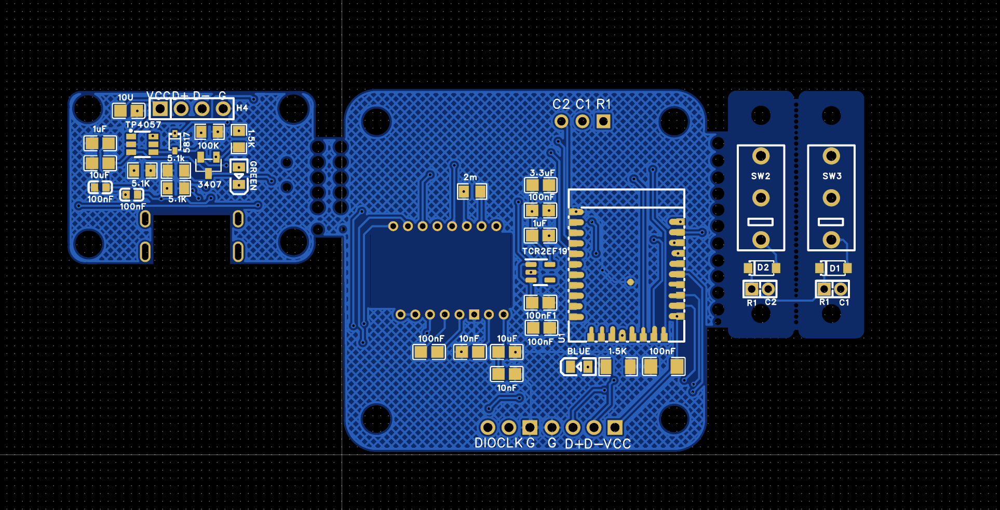
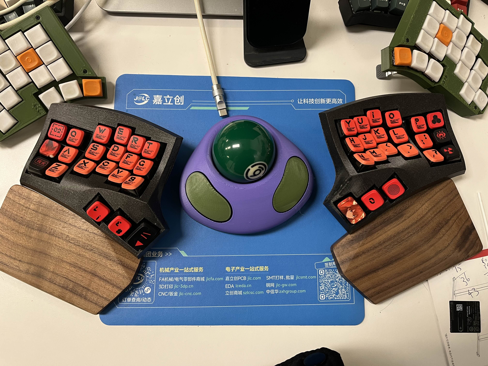

# ZMK Trackball Dongle

- [Chinese](README.md)
- [English](README_EN.md)

> Built using Micro52840 by Eyelash哥 for a dongle.
> I only bought it from Taobao but I asked for a link to the Aliexpress page. you can reference.
> Aliexpress : [Micro nrf52840](https://vi.aliexpress.com/item/1005007859027151.html?gatewayAdapt=glo2vnm)
This dongle requires you to flash the bootloader manually. The bootloader files are located in the `bootloader` folder. The PCB files can be opened with EDA software from Jialcit. The files in the `case` folder contain step files, which you can print yourself.

I have added a reset switch on the PCB of this dongle, so you can also use it as a standalone trackball device. The trackball model I referenced is from this project [Trackball-7](https://www.printables.com/model/83631-trackball-7), and I redrawed the PCB for it since the original version was a wired design using an RP2040 board. Here's the link to the original PCB: [https://github.com/jfedor2/rp2040-pmw3360](https://github.com/jfedor2/rp2040-pmw3360)

## Firmware repository

Firmware repository in [ZMK](./zmk/) below, in fact you can also go directly to my configuration warehouse: https://github.com/tokyo2006/zmk-for-cygnus/tree/36_trackball_mouse

## Components Required for PCB

| No.  | Quantity | Comment      | Value       | Manufacturer Part           | Manufacturer         | Supplier Part        | Supplier   |
|------:|----------|--------------|-------------|-----------------------------|---------------------|---------------------|------------|
| 1    | 1        | 1N4148W      |             | 1N4148W                     | CJ (Jiangsu Changchuan/Changjing) | C2099               | LCSC       |
| 2    | 1        | 1uF          | 1uF         | CL21B105KBFNNNE             | Samsung (三星)      | C28323              | LCSC       |
| 3    | 1        | 1.5kΩ        | 1.5kΩ       | 0805W8F1501T5E              | UNI-ROYAL (厚声)   | C4310               | LCSC       |
| 4    | 1        | 1.5kΩ        | 1.5kΩ       | 0805W8F5101T5E              | UNI-ROYAL (厚声)   |                     | LCSC       |
| 5    | 1        | 2mΩ          | 2mΩ         | RLM10FTSMR002               | Daye Technology     | C163090             | LCSC       |
| 6    | 1        | 3.3uF        | 3.3uF       | 0805B335K160NT              | FH (风华)           | C38332              | LCSC       |
| 7    | 1        | 5.1kΩ        | 5.1kΩ       | 0805W8F5101T5E              | UNI-ROYAL (厚声)   | C27834              | LCSC       |
| 8    | 1        | 10nF         | 10nF        | CC0805KRX7R9BB103          | YAGEO (国巨)        | C83170              | LCSC       |
| 9    | 1        | 10uF         | 10uF        | CL21A106KOQNNNE             | Samsung (三星)      | C1713               | LCSC       |
| 10   | 1        | 100kΩ        | 100kΩ       | 0805W8F1003T5E              | UNI-ROYAL (厚声)   | C149504             | LCSC       |
| 11   | 1        | 100nF        | 100nF       | 0805B104K500NT              | FH (风华)           | C38141              | LCSC       |
| 12   | 1        | 100nF        | 100nF       | CC0603KRX7R9BB104          | YAGEO (国巨)        | C14663              | LCSC       |
| 13   | 1        | AO3407       |             | AO3407                      | Hottech (合科泰)    | C181093             | LCSC       |
| 14   | 1        | B5817WS      | B5817WS     | Hongjia Orange              | C7420329            | LCSC                 |
| 15   | 1        | BX-TS-26-4417TT | BX-TS-26-4417TT | Bossie (博锡)              | C18078110           | LCSC       |
| 16   | 1        | CMI126603D09 |             | CMI126603D09                | Kailh (凯华)         | C400257              | LCSC       |
| 17   | 1        | MF200V-11-02P |             | MF200V-11-02P               | XFCN (兴飞)          | C501331              | LCSC       |
| 18   | 1        | MF254V-11-04-0743 |             | MF254V-11-04-0743         | XFCN (兴飞)          | C2889986           | LCSC       |
| 19   | 1        | MSS12C02LS-BB2.0 |             | MSS12C02LS-BB2.0            | SHOU HAN (首韩)      | C3008585           | LCSC       |
| 20   | 1        | NCD0805R1    | NCD0805R1   | Guoxin Optoelectronics     | C84256              | LCSC                 |
| 21   | 1        | PH1250-WT-02P |             | PH1250-WT-02P               | HOYU (皓宇电子)     | C2939411            | LCSC       |
| 22   | 1        | PM254-1-03-Z-3.0-C |             | PM254-1-03-Z-3.0-C         | HCTL (华灿天禄)      | C5159935           | LCSC       |
| 23   | 1        | N52840       |             |                             |                     |                     |            |
| 24   | 1        | PMW3610      |             |                             |                     |                     |            |
| 25   | 1        | TCR2EF19     | TCR2EF19    |                             |                     |                     |            |
| 26   | 1        | TP4057       |             | TP4057                      | UMW (友台半导体)     | C725791              | LCSC       |
| 27   | 1        | TYPE-C-31-M-13C |             | TYPE-C-31-M-13C            | South Korean Hwangyou | C2848620           | LCSC       |

## Assembly Materials Required

- One 57.2mm trackball (I used a snooker ball)
- Three 2.5mm silicon (or zirconia) bearing balls
- Four M2x9 screws for two buttons
- Four M2x4 screws for the sensor PCB
- Four M2x5 screws for the power PCB
- Three M2x10 screws for the top and bottom shells
- Two 601245/400mAh lithium batteries (I paralleled them, so together they are 800mAh)

## Related Images

### PCB

### Model

### My Own dongle

## Contribution Guidelines

If you wish to contribute code or documentation to this project, please follow these steps:

1. Fork this repository to your GitHub account.
2. Make modifications in your own branch.
3. Submit your changes and create a Pull Request.

## License

This project is open-source under the [CERN Open Hardware Licence Version 2](https://opensource.org/license/cern-ohl-p). For detailed license information, please refer to the [LICENSE](./LICENSE) file.

---

这篇翻译保持了原文的结构和内容，同时确保了技术术语和信息的准确性。你可以将这段文本保存为 `README_EN.md` 文件。